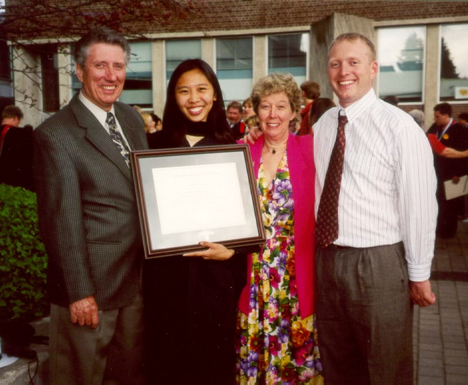
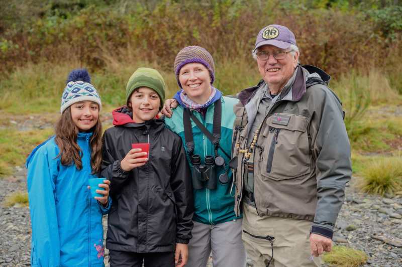
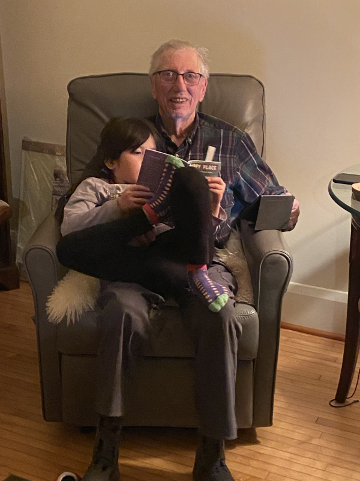
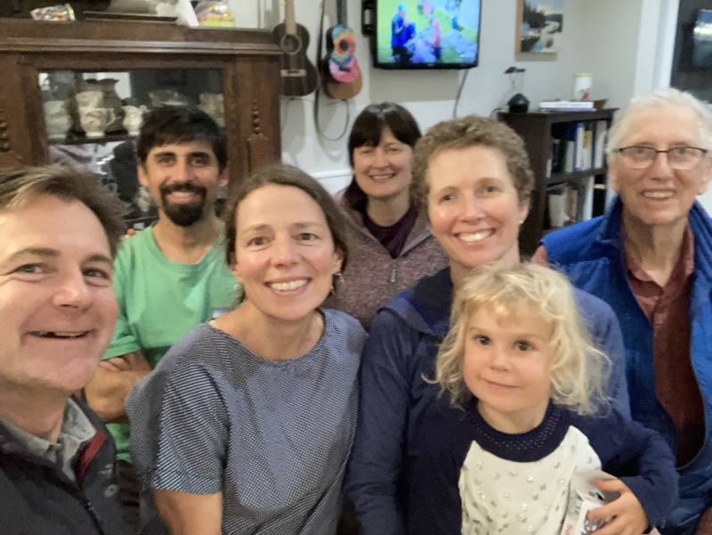
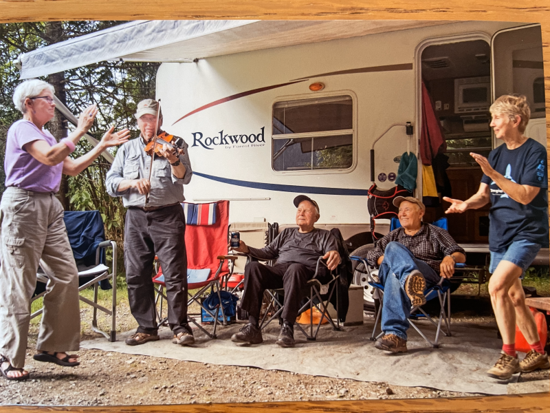

[Home](./README.md) &nbsp;&nbsp;&nbsp;&nbsp;[Celebration of Life](./celebration.md)  &nbsp;&nbsp;&nbsp;&nbsp;[Obituary](./obituary.md)  &nbsp;&nbsp;&nbsp;&nbsp;[Photos](./photos.md)  &nbsp;&nbsp;&nbsp;&nbsp;[Tributes](./tributes.md)
# Photos

_Please send your photos to anneduncan123@yahoo.ca and burnett@pm.me_  

## Recent Family Portraits

p001.  
p001.  

## Olden Days

p001.  
p033.   
p034.  
ron_olddays001  
ron_olddays002  
ron_olddays003  
ron_olddays004  

## More Family

p015.  
p003.  
p009.  
p010.  
p029.  
p030.  
p032.  
p038.  
p039.  
p024.  
p046.  
p047.  
p048.  
p049.  
p050.  
p054.  
p055.  
p058.  
p059.  
p060.  
p045.  
p017.  
p018.   
p021.  
p022.  
p023.   
p025.  
p002.  
p056.  
p008.  
p051.  
p052.  
p053.  
p031.  
p016.  
p040.  
p061.  
p027.  
ron_family001  
ron_family002  
ron_family003  
ron_family004  
ron_family005  
ron_family006  
ron_family007  

## Friends

p028.  
p043.  
p044.  
p026.  
ron_friends001  
ron_friends002   
ron_friends003   
ron_friends004   
ron_friends005   
ron_friends006   
ron_friends007   
ron_friends008   
ron_friends009    

## Fishing

p004.   
p006.  
p007.  
p011.  
p012.  
p013.  
p014.   
p035.  
p062.  
p042.  
p063.  - YouTube fishing on the Sooke River in October 2014 - [https://youtu.be/aT3R9rvY1-I](https://youtu.be/aT3R9rvY1-I) 
ron_fishing001  
ron_fishing002  
ron_fishing003  
ron_fishing004  
ron_fishing005  
ron_fishing006  
ron_fishing007  

## Food

p036.  
p041.  
p057.  
ron_foodie001  
ron_foodie002  
ron_foodie003  
ron_foodie004  

