[Home](./README.md) &nbsp;&nbsp;&nbsp;&nbsp;[Celebration of Life](./celebration.md)  &nbsp;&nbsp;&nbsp;&nbsp;[Obituary](./obituary.md)  &nbsp;&nbsp;&nbsp;&nbsp;[Photos](./photos.md)  &nbsp;&nbsp;&nbsp;&nbsp;[Tributes](./tributes.md)
# Photos

_Please send your photos to anneduncan123@yahoo.ca and burnett@pm.me_  

## Recent Family Portraits

 
 

## Olden Days

 
  
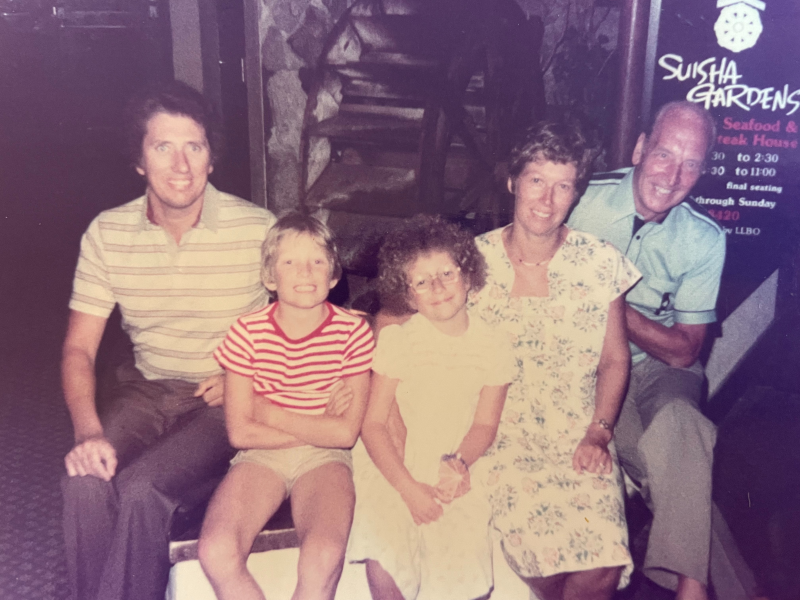 
 
 
 
 

## More Family

 
 
 
 
 
 
 
 
 
 
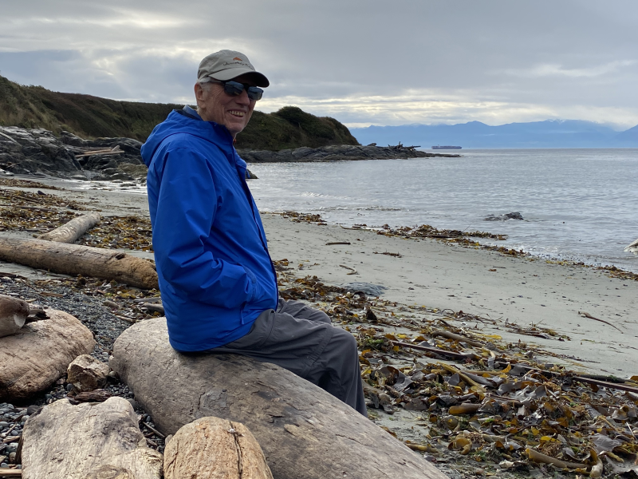 
 
 
 
 
 
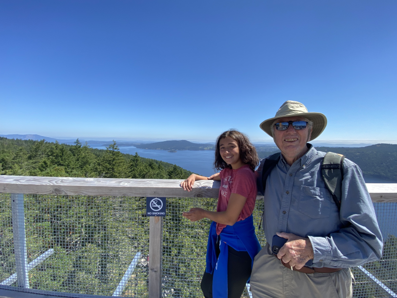 
 
 
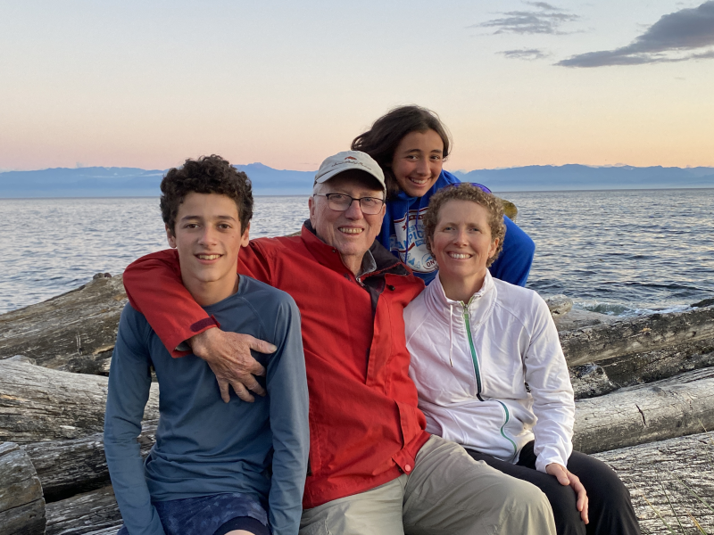 
 
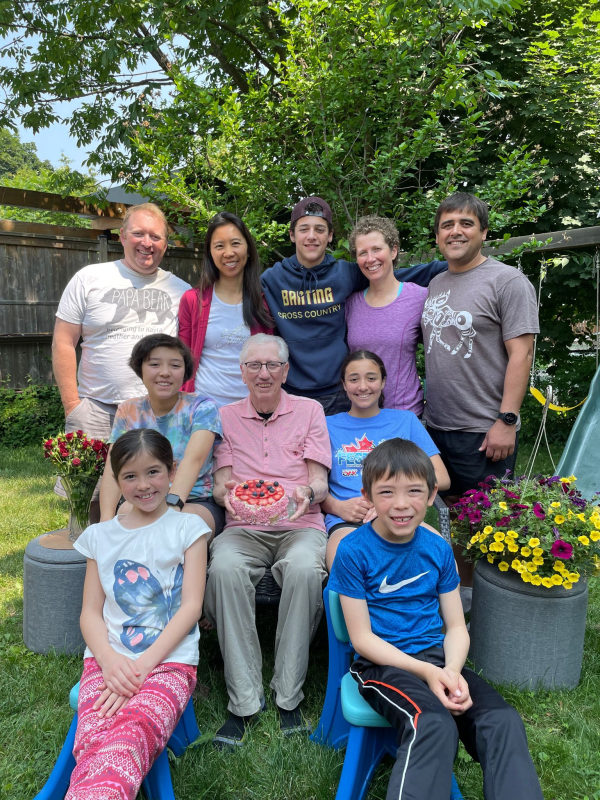 
  
 
 
  
 
 
 
 
 
 
 
 
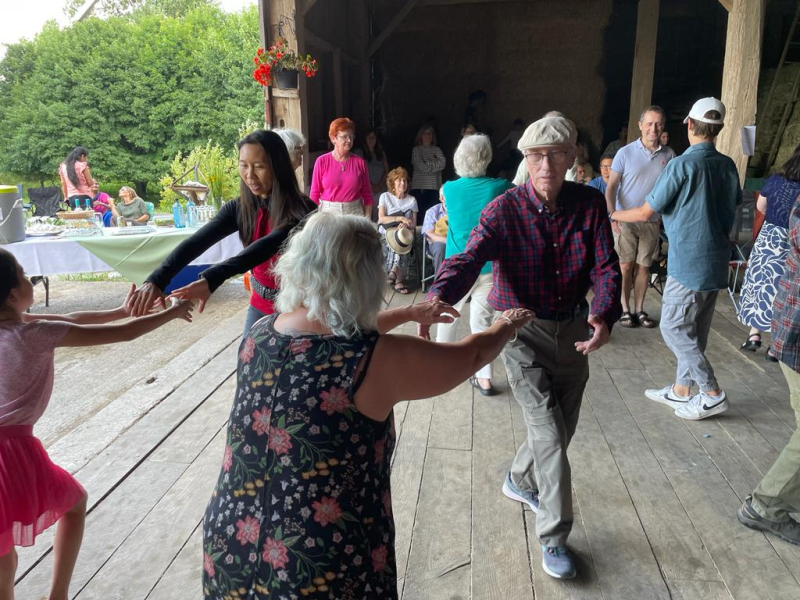 
 
 
 
 
 
 
 
 
 
 
 
 
 
 
 
 
 
 
 
 
 
 
 
 
 
 
 
 
 
 
 
 
 
 
 
 
 
 
 
 
 

## Friends

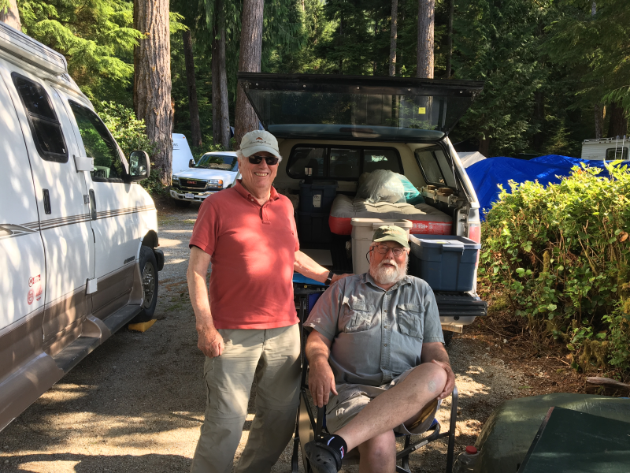 
 
 
 
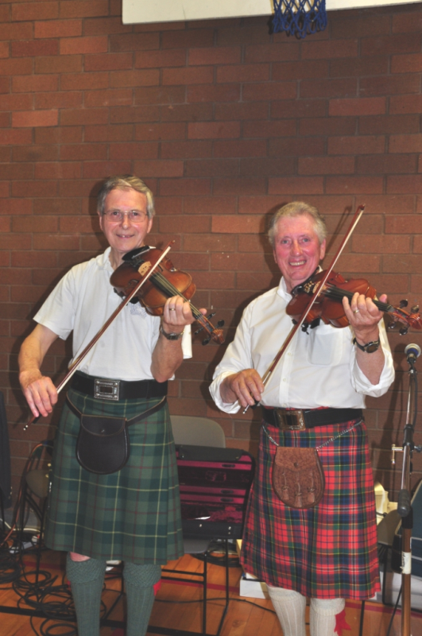 
 
  
  
  
  
  
  
  
   

## Fishing

  
 
 
 
 
 
  
 
 
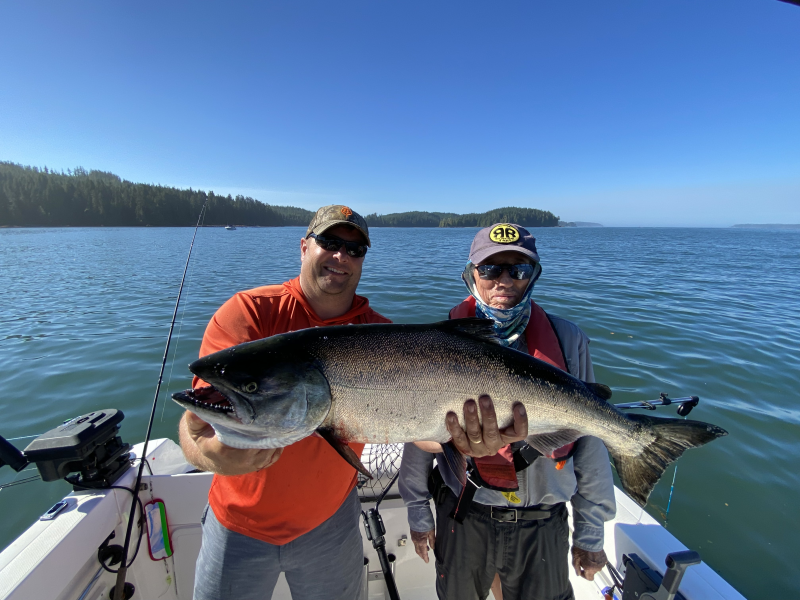 
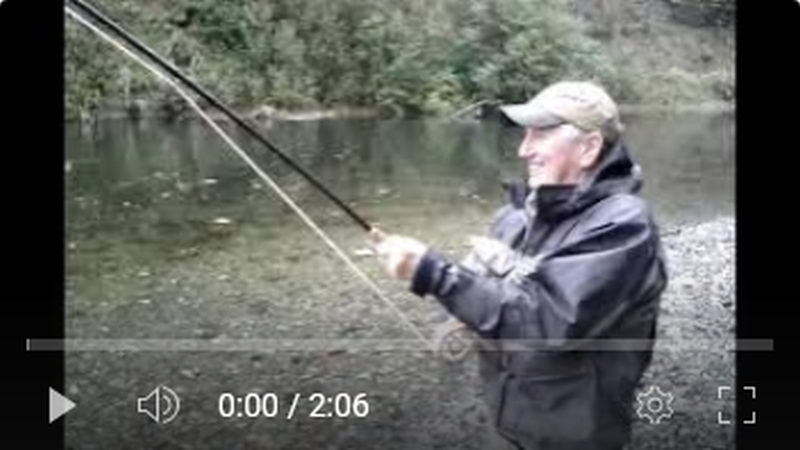 - YouTube fishing on the Sooke River in October 2014 - [https://youtu.be/aT3R9rvY1-I](https://youtu.be/aT3R9rvY1-I) 
 
 
 
 
 
 
 
 
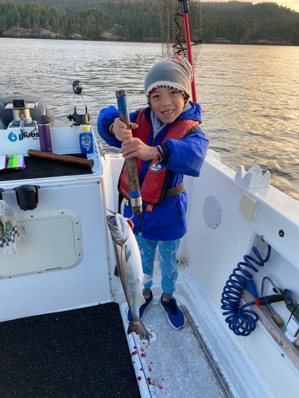 
 
 
 
 
 

## Food

 
 
 
 
 
 
 
 

