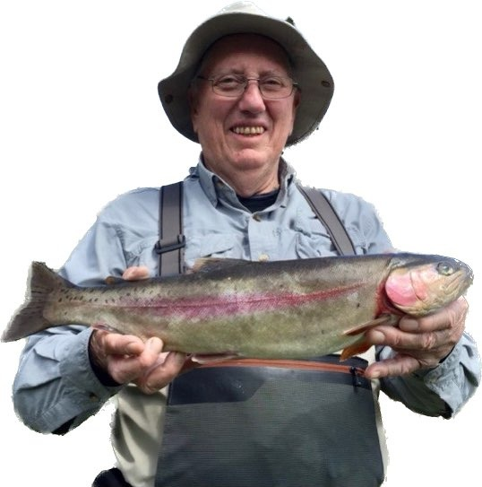

[Home](./README.md)

[Home](./README.md) &nbsp;&nbsp;&nbsp;&nbsp;[Celebration](./celebration.md)  &nbsp;&nbsp;&nbsp;&nbsp;[Obituary](./obituary.md)  &nbsp;&nbsp;&nbsp;&nbsp;[Photos](./photos.md)  &nbsp;&nbsp;&nbsp;&nbsp;[Tributes](./tributes.md)

# Tributes & Memories

_Please send your notes to anneduncan123@yahoo.ca and burnett@pm.me_ 

Ron, you have been a wonderful friend to us and we have enjoyed so many fun times and great laughter and wonderful music together. 
We will miss you terribly. - Sandra and Steve Neilson - Victoria, BC

I am so sorry that I won't get to share more music with you. Even as I say that, it makes me remember the many laughs we had at Sandra's over the past several years and how many tunes you had in your repertoire, especially the Scottish ones. And your teasing ways and jokes and stories! Of course we all got to share in the treats you brought. Well, it just doesn't seem right that you contributed so much to those enjoyable times and that now you can't. There is a great sadness in me for that loss.  
However, you sure made the most of these last few years, every day a new one. I think there is a lot to be said about the attitude - I think for quite some time you have shown a positive attitude and that can be a lesson for all of us as we face our own hardships. Maybe the capper on that approach was the purchase of your new car that you got to enjoy - and especially as you drove around in Western Canada with your visitors from Japan. Visualizing that tour makes me smile - talk about seizing the moment! - Jeanne Melady - Victoria, BC

I keep thinking about all the wonderful times we spent together. I feel so fortunate to have had you as a friend and want to say thank you for the many ways in which you have brought joy into my life.  I hope that you will take some comfort in knowing how much you have enriched the lives of others. Many of my best memories in some way involve you and I will forever be indebted. Thank you. - Eldon and Brenda Cooper - Tillsonburg, Ontario

I write this goodbye letter with much sadness, but also with fond memories of the many wonderful days we have spent together in Ontario and more recently in BC. Through knowing you and your Sheila, Catharine and I experienced some of the happiest occasions in our lives, for which I shall always be grateful. May you rest comfortably and peacefully in the days ahead. You will be continually in my thoughts and in those of Shirley. 
With our warmest wishes as ever, - David Gallop - England

Thank you for  making my life more interesting for the last approximately 7 years. You got me into The Golden Rods and Reels club and it has been a real stimulation to me. Since as far as I can tell you’ve been a good person, as have I, and we, at some point in the future, must team up to find Brother 12s Gold and fish some huge fish lakes along the way. - Mike Corry - Victoria, BC

Ron, you have been an inspiration to many. You fought the good fight and had many good experiences before the cancer took over. 
It was so wonderful knowing you, playing music together and having some good laughs. - Dawne, the mandolin “lass” - Victoria, BC

Dear Ron,  I will so miss your hugs, smiles and encouragement at Folkestra, seeing you at Sarah and Tjabo’s place playing with Ulla, and hearing stories of all the fish that you caught out on the rivers and oceans around us. Go onwards knowing that you touched me and mine with your joie-de-vivre and enthusiasm, and we will talk fondly of you in the years to come. In addition, every time I play or hear the lovely Neil Gow’s Lament on the Death of his Second Wife, a fiddle song which you gave me the sheet music for, I will think of you!  
You are a kind and lovely soul, and I am so grateful to have known you. With love,_ - Memet and family Burnett-Browne - Victoria, BC

Dear Ron, we will miss your huge smile and great sense of humour, and your infectious enthusiasm for the tunes and the songs, as well as your warmth and generosity.   We're so glad to have had your company, your sense of fun and the tunes you brought... when you weren't out fishing, of course! - Lucinde and Graham Metcalfe - Victoria, BC

Ron, you were a highly respected Vice Principal in the schools of the London Board of Education.   It has been such a great pleasure to receive your fairly regular updates, reporting on your fabulous life experiences. Whether running the B&B in Port Rowan or administering a school in China or bringing home your new bride from Japan, your life story has been amazing.  I have so appreciated receiving your fairly regular reports on salmon fishing in BC of fiddling sessions by the ocean. 
So we say “Farewell, good friend”._br>
Put in a good word for us, and we will all hope to meet again in a better place. 
We wish you good comfort and an easy passage. 
Much love and appreciation. - Ross Turnbull (and Al and Nancy Herrington) - Ontario

We have had such good times making music together over the years. You have given me many happy memories. We have played together at Folkestra and at a number of regular jams around town and we managed to get together a couple of times to play some tunes downstairs at your apartment on Dallas Road. 
It's great that you were able to accomplish so much over the last year, Ron. You've had some good innings, as they say! 
Keep humming those Scottish tunes! - Tony Lambert - Victoria, BC

Ron coaxed me back into fly-fishing after a 20 year hiatus, guiding me onto Matheson and Durrance Lakes and to the Sooke and Cowichan Rivers. He was generous with his time and advice, always positive, and keen to answer questions. - Charles Burnett- Victoria, BC

 
We must hold onto life and its opportunities and experiences like Ron is holding this fish - it can be slippery and get away on us if we’re not careful! But it’s so full of blessings. - Daniel Lapp to <a href="https://vcm.bc.ca/learn/programs/folkestra/" target="_blank">Folkestra</a> members, Victoria, BC